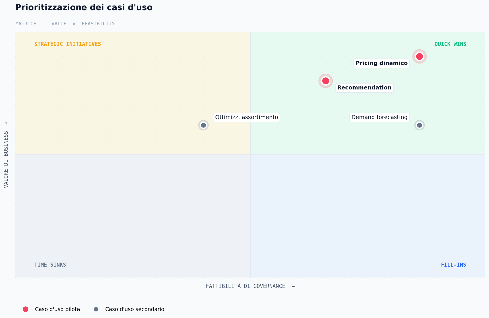
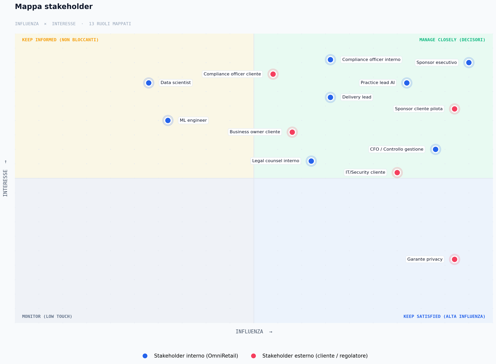
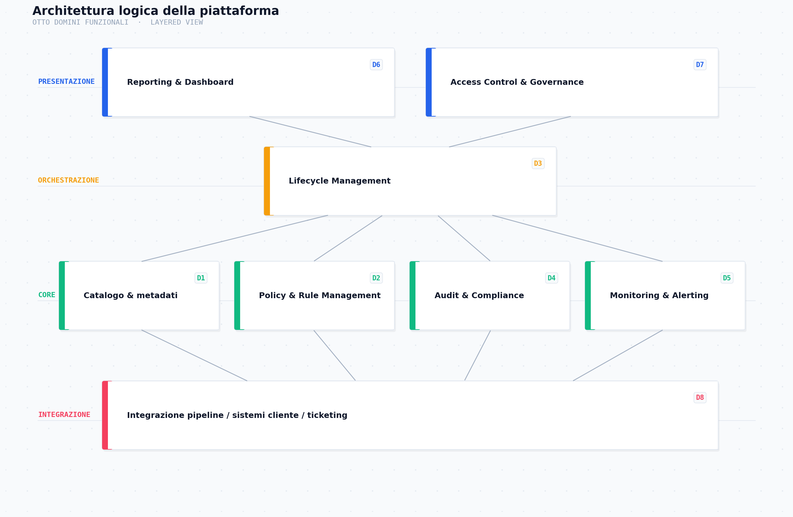
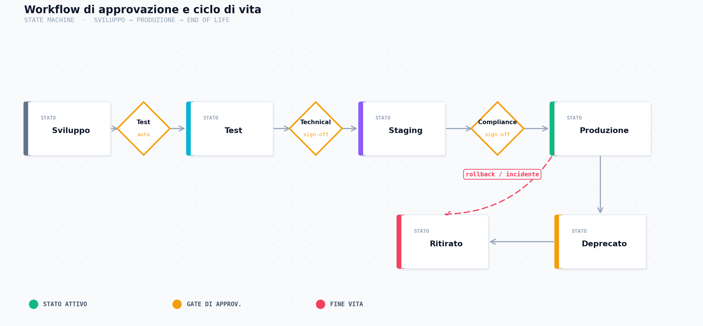
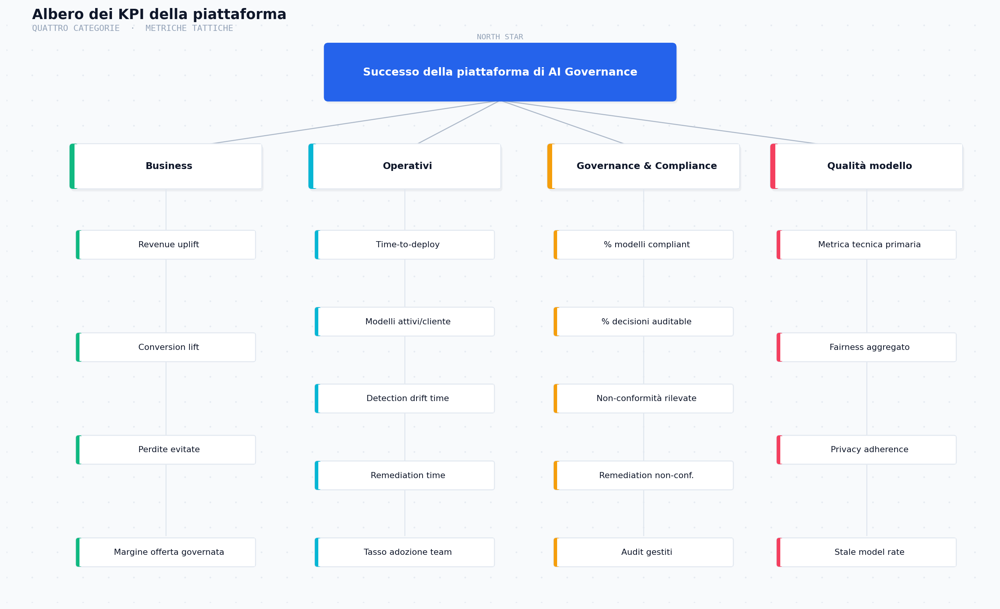
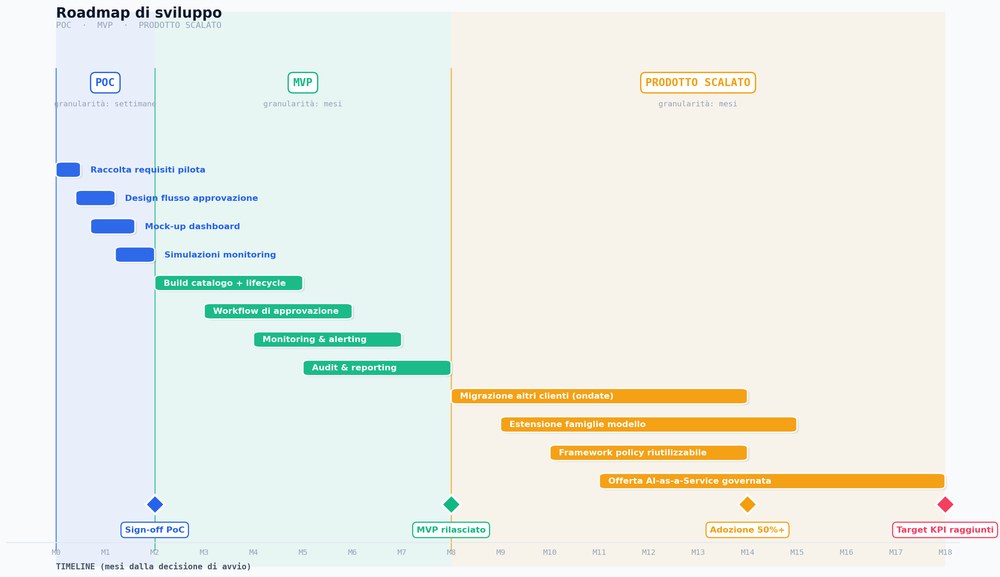
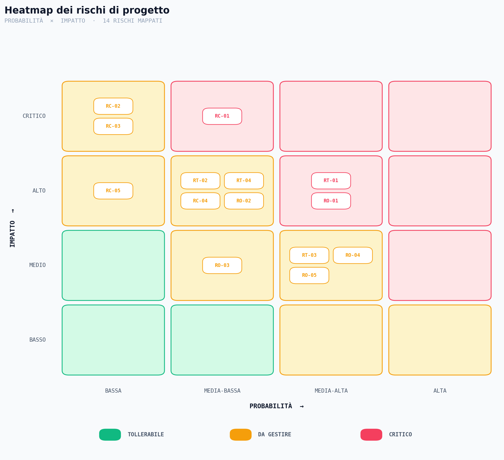

# Piattaforma di AI Governance per OmniRetail Advisory

**Dalla visione di business al deployment di un sistema AI**

| Voce | Dettaglio |
|---|---|
| Autore | Simone La Porta |
| Modulo | 04 - Business Case & AI Project Management |
| Versione | 1.0 |
| Stato | Documento di progetto per validazione management |
| Audience primaria | Management OmniRetail Advisory, partner consulenziali |
| Audience secondaria | Compliance officer, data science lead, delivery manager |

---

## Nota metodologica sui numeri

Tutte le cifre presentate in questo documento sono **valori indicativi** costruiti sulla base di benchmark di mercato pubblicamente disponibili (Algorithmia 2021 *State of Enterprise ML*, McKinsey *State of AI* 2023-2024, Capgemini Research Institute 2024, Gartner *AI in Organizations*) e applicate al profilo di una consulenza retail di media dimensione coerente con la descrizione di OmniRetail Advisory. Ogni cifra è accompagnata da:

- la **catena di assunzioni** che la genera;
- un **controllo di plausibilità** rispetto a fonti pubbliche o esperienza di mercato;
- l'esplicita raccomandazione di **rivalidare ogni valore con dati interni reali** prima dell'impegno di budget.

Nessuna cifra deve essere letta come stima vincolante. L'appendice C raccoglie l'elenco completo delle assunzioni quantitative usate.

---

## Executive Summary

OmniRetail Advisory gestisce un portafoglio crescente di soluzioni AI per il mondo retail (pricing dinamico, recommendation, demand forecasting, ottimizzazione assortimento) erogate a clienti diversi attraverso team distinti. L'assenza di una governance unificata su modelli, dataset, policy e metriche di impatto sta producendo tre effetti misurabili: tempi di deploy che oscillano tra **12 e 16 settimane** per progetti comparabili, una stima di **5-8 incidenti di governance all'anno** ciascuno con un costo medio di remediation tra **€50k e €150k**, e un'**erosione del margine** sulla parte ripetibile degli ingaggi dovuta al rework di documentazione, audit e setup di monitoring.

La proposta è la realizzazione di una **piattaforma di AI Governance interna**, posta a livello consulenziale e indipendente dallo stack tecnico dei singoli clienti, che governa il ciclo di vita dei modelli (catalogazione, versioning, approvazione, monitoraggio, ritiro), centralizza le policy aziendali (privacy, fairness, accesso), e produce reportistica di impatto business uniforme attraverso il portafoglio. La piattaforma **non sostituisce gli ambienti di produzione dei clienti**, ma fornisce un layer di governance trasversale che ogni progetto retail di OmniRetail attraversa.

La rollout è strutturata in tre fasi: **PoC (4-8 settimane)** per validare il design e i KPI su un caso d'uso pilota, **MVP (3-6 mesi)** per portare in esercizio le funzionalità minime su un cliente reale, e **prodotto scalato (6-12+ mesi)** per estendere a tutti i clienti e integrare la governance nell'offerta come elemento differenziante. Il payback atteso, costruito su assunzioni esplicite e validato in §1.4, si colloca tra **24 e 36 mesi** in scenario base, con benefici annui di regime stimati tra **€1,1M e €2,9M** tra time-to-market accelerato, incidenti evitati e nuova capacità di vendere offerte AI-as-a-Service governate.

Le decisioni che si richiedono al management sono tre: confermare il **caso d'uso pilota** (pricing dinamico + recommendation per un cliente di riferimento), allocare il **budget di PoC** stimato in €120-180k tra esterno e tempo interno, e nominare lo **sponsor esecutivo** con autorità di sblocco trasversale tra delivery, compliance e legale.

---

## 1. Contesto aziendale e business case

### 1.1 Profilo di OmniRetail Advisory

OmniRetail Advisory opera come consulenza specializzata nella progettazione e nel delivery di soluzioni AI per catene retail di grande e media dimensione. Il portafoglio attivo è composto, secondo l'ipotesi di lavoro adottata, da **30-50 modelli in produzione** distribuiti tra **5-10 clienti** retail, con quattro famiglie principali di soluzioni:

| Famiglia | Esempi di applicazione |
|---|---|
| Pricing dinamico | Adeguamento prezzi listino su canali online; markdown stagionale; risposta a competitor monitoring |
| Recommendation | Suggerimenti prodotto online; cross-sell e up-sell alla cassa fisica; bundling personalizzato |
| Demand forecasting | Previsione vendite per SKU/punto vendita; pianificazione approvvigionamento |
| Ottimizzazione assortimento | Definizione mix prodotti per cluster di store; rotazione e dismissione SKU |

> **Ipotesi quantitativa.** 30-50 modelli attivi. **Catena di assunzioni:** 5-10 clienti × 3-5 famiglie di modello × 1-2 varianti (per canale, format, area geografica). **Plausibilità:** Capgemini Research Institute (2024) rileva che le aziende "AI-mature" gestiscono in media 50-150 modelli in produzione; una consulenza che orchestra esecuzione su più clienti aggrega frazioni di questi numeri. La fascia 30-50 corrisponde a un profilo di consulenza con pratica AI consolidata ma non leader di mercato.

### 1.2 Problema e opportunità

Le criticità che la piattaforma di governance intende risolvere si raggruppano in cinque categorie. La prima e la più urgente è la **frammentazione operativa**: ogni team consulenziale ha sviluppato proprie convenzioni di versioning, propri template di documentazione, propri framework di monitoraggio. Il risultato è che, quando un modello incontra un problema in produzione, il tempo per ricostruire cosa è stato cambiato, chi ha approvato cosa e quale versione è effettivamente in esercizio è significativo e in alcuni casi proibitivo.

La seconda è il **rischio di compliance**. Il portafoglio retail tocca dati personali (profilazione clienti, storico acquisti, comportamento online) e produce decisioni automatizzate (prezzi, suggerimenti, dismissioni). La cornice normativa applicabile include il GDPR, le indicazioni emergenti dell'AI Act europeo per i sistemi a rischio limitato e i requisiti di antidiscriminazione che si applicano alle decisioni automatizzate. Senza una governance centrale, ogni cliente eredita il rischio della consulenza, e ogni consulenza eredita il rischio del cliente.

La terza è la **misurazione dell'impatto business**. La maggior parte dei modelli viene valutata in fase di sviluppo su metriche tecniche (accuracy, RMSE, AUC) ma in produzione il legame con i KPI di business del cliente (uplift di revenue, conversion, riduzione perdite) è spesso indiretto, tardivo o mancante. Questo erode la capacità di dimostrare valore in fase di rinnovo contrattuale.

La quarta è il **time-to-market**. Ogni nuovo ingaggio retail riparte da convenzioni diverse, da template ricostruiti caso per caso, da approvazioni rinegoziate. Il deploy medio di un modello pronto in sviluppo si attesta tra **12 e 16 settimane** per la frazione operativa (audit, doc, setup monitoring, integrazione cliente), contro un benchmark di industry di **6-10 settimane** per organizzazioni con governance matura.

> **Ipotesi quantitativa.** Time-to-deploy 12-16 settimane attuale. **Catena di assunzioni:** ~2-3 settimane di doc e packaging + ~3-4 settimane di approvazione interna e cliente + ~3-5 settimane di setup monitoring e integrazione + ~2-3 settimane di rework per disallineamenti. **Plausibilità:** Algorithmia (2021) riporta che il 64% delle organizzazioni impiega oltre un mese per portare in produzione un modello pronto, il 38% oltre tre mesi. Il range 12-16 settimane si colloca nella metà superiore della distribuzione, coerente con un setup multi-cliente non standardizzato.

La quinta, infine, è la **scalabilità dell'offerta**. Senza piattaforma, ogni nuovo cliente richiede un effort di setup quasi pieno; con piattaforma, il setup di governance per un nuovo cliente dovrebbe ridursi a configurazione di tenant, profili utente e policy specifiche. Questo libera capacità per acquisire più clienti senza aumentare proporzionalmente lo staff.

### 1.3 Obiettivi di business

La piattaforma si propone obiettivi articolati su quattro dimensioni:

| Dimensione | Obiettivo a 18 mesi | Indicatore principale |
|---|---|---|
| Affidabilità | Ridurre del 60-70% gli incidenti di governance del portafoglio | Numero incidenti/anno (cfr. §6) |
| Velocità | Portare il time-to-deploy medio sotto le 8 settimane sui progetti governati dalla piattaforma | Time-to-deploy mediano |
| Compliance | Raggiungere il 95% di modelli con documentazione completa e audit-ready in tempo reale | % modelli compliant |
| Commerciale | Abilitare offerte AI-as-a-Service governate con uplift di margine atteso del 15-25% sul ricavo dei modelli inclusi | Margine incrementale su offerte governance-as-a-feature |

Gli obiettivi sono dichiarati a 18 mesi dalla decisione di avvio per dare al business uno spazio di realizzazione coerente con le tre fasi della rollout (PoC, MVP, Scale) e con i tempi minimi di adozione da parte dei team consulenziali interni.

### 1.4 Benefici attesi e business case quantitativo

I benefici attesi si compongono di tre flussi distinti, ciascuno costruito su assunzioni esplicite. Il totale annuo di regime, sotto scenario base, è stimato tra **€1,1M e €2,9M** di valore creato. L'investimento aggregato a 3 anni è stimato tra **€3,5M e €5,5M** tra build e operations, producendo un payback in scenario base **tra 24 e 36 mesi**.

#### Beneficio 1 - Riduzione del time-to-market sui progetti ripetibili

> **Ipotesi.** Riduzione del time-to-deploy del 30-40% sui progetti governati dalla piattaforma, applicata al 60-70% del portafoglio. **Catena di assunzioni:** la piattaforma standardizza le componenti operative (audit, doc, monitoring setup) ma non quelle creative (problem framing, modellazione). Il 30-40% è ottenuto compressando la sola coda operativa, che vale ~50% del time-to-deploy totale. **Plausibilità:** piattaforme di accelerazione consulenziale (Accenture myWizard, Capgemini Tonik) dichiarano 30-50% di accelerazione su progetti ripetibili; il range 30-40% è la fascia centrale e prudente.

Tradotto in valore economico, un'accelerazione del 30-40% libera capacità per **5-10 progetti retail aggiuntivi all'anno** sulla stessa base di staff. Ipotizzando un valore medio di **€300-500k per progetto** con un **margine del 25-35%**, il margine incrementale annuo si colloca tra **€0,4M e €1,7M**.

> **Ipotesi.** Valore medio €300-500k per progetto. **Catena di assunzioni:** il range di ingaggio tipico per un progetto retail multi-modello è €200k-€1M; €300-500k è la fascia centrale che esclude i progetti molto piccoli (PoC client-side) e i grandi programmi trasformativi. **Plausibilità:** day-rate consulenza data €800-1500 × 6-8 mesi di engagement × 2-3 risorse = €200-700k. La fascia centrale conferma il range.

#### Beneficio 2 - Incidenti di governance evitati

> **Ipotesi.** Riduzione del 60-70% degli incidenti di governance/anno (da 5-8 a 1-3). **Catena di assunzioni:** monitoring di drift attivo + audit-ready continuo + workflow di approvazione formalizzato eliminano la classe più frequente di incidenti (deviazioni non rilevate, modelli non documentati, modifiche non tracciate). Restano gli incidenti residui legati a problemi nei dati a monte o a comportamenti adversariali non previsti. **Plausibilità:** McKinsey (2023) attribuisce il 60-80% degli incidenti AI a cause governance-correlate; il range proposto è coerente con questa banda.

Costo medio per incidente evitato: **€50-150k**, dove il range copre:

| Componente | Range |
|---|---|
| Engineering di remediation (retraining, hotfix, rerun pipeline) | €25-60k (~2-4 settimane × 2 ingegneri × day-rate consulenza) |
| Tempo legale e compliance | €5-20k |
| Impatto reputazionale e billing | €10-40k (sconto su contratto, mancato rinnovo parziale) |
| Documentazione e audit straordinario | €10-30k |

Risparmio annuo da incidenti evitati a regime: **€200k - €840k**, calcolato come `(3-5,6 incidenti evitati/anno) × (€50-150k per incidente)` arrotondato. Il valore atteso a Year 3, quando il prevention rate è stabilizzato, si colloca nel terzo superiore di questa fascia.

> **Esclusioni esplicite.** La stima non include eventi catastrofici stile Air Canada-class (causa legale con esposizione multi-milionaria) che si collocherebbero in un range €1-5M per evento. Questi eventi sono coperti dall'analisi di rischio in §8, non dal beneficio atteso.

#### Beneficio 3 - Nuova capacità di offerta AI-as-a-Service governata

> **Ipotesi.** Capacità di vendere un'offerta "AI governata" come elemento differenziante, con uplift di margine atteso del 15-25% sui contratti che la includono. **Catena di assunzioni:** clienti regolamentati (banche, retail multi-paese, GDO con esposizione GDPR alta) valutano la governance come fattore di scelta. La piattaforma diventa un asset commerciale, non solo operativo. **Plausibilità:** Gartner (2024) indica che il 35-40% dei buyer enterprise considera la governance AI fattore critico nella selezione di fornitori esterni. Un uplift del 15-25% su una frazione del portafoglio (il 20-30% nei primi due anni) è una stima prudente.

Margine incrementale annuo a regime: **€200-300k** nei primi due anni, crescente a **€500-800k** dal terzo anno se il posizionamento si consolida.

#### Sintesi del business case

I numeri seguenti sono ottenuti combinando i tre flussi sopra, con un profilo di ramp-up: Year 1 vede principalmente costi di build con benefici limitati al disegno del PoC e ai primi modelli del cliente pilota; Year 2 raggiunge un break-even annuo grazie all'MVP operativo; Year 3 stabilizza i benefici di regime con l'estensione al portafoglio.

| Flusso | Anno 1 | Anno 2 | Anno 3 |
|---|---|---|---|
| Riduzione time-to-market | €0,1-0,3M | €0,3-0,8M | €0,4-1,2M |
| Incidenti evitati | €0,1-0,3M | €0,2-0,6M | €0,3-0,9M |
| Nuova offerta governata | €0,0-0,1M | €0,2-0,3M | €0,4-0,8M |
| **Totale benefici annui** | **€0,2-0,7M** | **€0,7-1,7M** | **€1,1-2,9M** |
| Investimento (build + run) | €1,5-2,5M | €0,8-1,2M | €0,9-1,3M |
| **Saldo annuo** | **-€1,3 / -€1,8M** | **-€0,1 / +€0,5M** | **+€0,2 / +€1,6M** |
| **Cumulato a fine anno** | **-€1,3 / -€1,8M** | **-€1,4 / -€1,3M** | **-€1,2 / +€0,3M** |

> **Costo totale stimato 3 anni.** €3,2-5M aggregato. **Catena di assunzioni:** build PoC + MVP €1,5-2,5M Year 1 (team interno 6-10 persone + qualche esterno specialista compliance/MLOps); operations a regime €0,8-1,3M/anno (1-2 ingegneri full-time + frazioni di compliance e product). **Plausibilità:** allineato con il TCO di piattaforme di governance comparabili in consulenza media-grande, tipicamente nell'ordine dell'1-3% del fatturato della pratica AI per i primi tre anni.

Lo scenario base produce un **payback compreso tra 24 e 36 mesi**: il break-even cumulato cade nella seconda metà di Year 3 se le assunzioni di ramp-up tengono. Lo scenario ottimistico (assunzioni superiori del range) può portare il payback sotto i 24 mesi; lo scenario pessimistico (assunzioni nella metà inferiore + ritardi di adozione) lo sposta oltre i 36 mesi. L'analisi di sensitività esplicita è in appendice C.

### 1.5 Success criteria

Il successo della piattaforma sarà valutato su tre orizzonti:

- **A fine PoC (mese 2):** lo sponsor esecutivo, il delivery lead del cliente pilota e il compliance officer concordano formalmente che i requisiti raccolti, i KPI proposti e il flusso di approvazione mockato rispondono alle reali esigenze operative. Senza questo allineamento il progetto si ferma.
- **A fine MVP (mese 8-10):** la piattaforma gestisce in modo end-to-end almeno **5 modelli del cliente pilota**, raccoglie KPI di baseline verificabili (tempo di deploy, drift detection time, % documentazione completa), e produce report di impatto business utilizzabili in conversazione con il cliente.
- **A fine prodotto scalato (mese 18-24):** la piattaforma copre il **80%+ del portafoglio attivo**, gli indicatori chiave hanno mostrato il miglioramento atteso (cfr. §6), e almeno un ingaggio commerciale è stato chiuso con la governance come elemento differenziante esplicito.

---

## 2. Casi d'uso

### 2.1 Prioritizzazione dei casi d'uso

I quattro casi d'uso candidati (pricing dinamico, recommendation, demand forecasting, ottimizzazione assortimento) sono stati posizionati sulla matrice Value/Feasibility introdotta in [`notes/01_identifying_ai_problems_and_feasibility.md`](../notes/01_identifying_ai_problems_and_feasibility.md). La scelta del caso pilota è guidata dalla volontà di massimizzare la trazione del PoC senza assumere rischi tecnici aggiuntivi.

| Caso d'uso | Valore di business | Fattibilità di governance | Quadrante | Decisione |
|---|---|---|---|---|
| Pricing dinamico | Alto (revenue diretto, esposizione regolatoria alta) | Alta (modelli relativamente standard, dati strutturati) | Quick Win | **Pilota** |
| Recommendation | Alto (conversion, engagement) | Alta (componente di fairness aggiunge complessità ma è gestibile) | Quick Win | **Pilota** |
| Demand forecasting | Medio-alto (impatto su scorte) | Alta (modelli predittivi più tradizionali, audit più semplice) | Quick Win | Secondario, ingresso MVP |
| Ottimizzazione assortimento | Medio (impatto lungo termine, ROI più lento) | Media (decisioni interagiscono con processi commerciali umani, governance del processo decisionale) | Strategic Initiative | Secondario, ingresso Scale |

La scelta di accoppiare **pricing dinamico** e **recommendation** come caso pilota è motivata da tre ragioni: entrambi producono **decisioni rivolte all'esterno** (prezzi visibili al consumatore, suggerimenti che orientano gli acquisti) e quindi attivano la cornice regolatoria che la piattaforma deve dimostrare di gestire; il volume di esecuzione è **alto e continuo**, condizione necessaria per testare in modo significativo monitoring e drift detection; il legame con i **KPI di business** del cliente è diretto e misurabile in tempi brevi, abilitando una validazione del valore generato già in fase PoC.

### 2.2 Caso d'uso principale - pricing dinamico e recommendation

**Contesto operativo.** Un cliente retail multi-canale (e-commerce + rete fisica) gestisce un catalogo di 50-100k SKU. Due famiglie di modelli AI operano in produzione: il **modello di pricing dinamico** aggiorna i prezzi listino online due volte al giorno sulla base di domanda, scorte, competitor e calendario commerciale; il **motore di recommendation** suggerisce prodotti su homepage, pagine prodotto e a valle della ricerca, con personalizzazione basata su storico cliente.

I due modelli sono sviluppati da team consulenziali distinti all'interno di OmniRetail, sono stati messi in produzione in tempi diversi, usano stack di feature engineering disgiunti, e ciascun team produce reportistica con cadenza e granularità proprie. Il cliente lamenta da mesi:

- **Mancanza di tracciabilità delle versioni:** quando un'anomalia di prezzo viene riportata dal customer service, ricostruire quale versione del modello era attiva, su quali dati era stata addestrata e chi aveva approvato il deploy richiede tipicamente 2-5 giorni.
- **Assenza di metriche standard:** il pricing riporta uplift in margine sul listino, la recommendation riporta CTR e revenue su sessione; mancano metriche comparabili sull'esperienza cliente integrata e sull'impatto cross-canale.
- **Rischio di conformità non controllato:** non esiste un controllo sistematico che i prezzi proposti rispettino i vincoli di antidiscriminazione (es. assenza di personalizzazione di prezzo basata su variabili protette), né che le recommendation rispettino la policy di profilazione minima del cliente. Il cliente è esposto a query del proprio garante della privacy senza una linea di difesa documentale strutturata.

**Obiettivi specifici del caso pilota.** Tracciabilità completa di tutte le versioni di modello attive, con audit trail per ogni deploy che includa training data identifier, hyperparametri, ownership e approvazioni; reporting unificato e automatico su un set comune di metriche di performance e impatto revenue, con cadenza settimanale e drill-down per canale e segmento; allineamento documentato di entrambi i modelli alle policy di privacy e antidiscriminazione del cliente, con prove di adesione audit-ready in qualunque momento.

#### Requisiti funzionali

Per il caso pilota, la piattaforma deve coprire i seguenti requisiti funzionali, espressi a livello di capability senza scelta tecnologica:

| ID | Requisito | Priorità |
|---|---|---|
| RF-01 | Catalogazione dei modelli con metadati strutturati (ownership, training data, dipendenze, scope di utilizzo) | Must |
| RF-02 | Versioning immutabile delle release di modello, con identificatore univoco e collegamento al training data snapshot | Must |
| RF-03 | Workflow di approvazione configurabile, con gate obbligatori per passaggio in produzione (technical sign-off, compliance sign-off) | Must |
| RF-04 | Registro decisionale: per ogni decisione prodotta dal modello in produzione, possibilità di tracciare la versione attiva e l'input principale (con campionamento configurabile) | Must |
| RF-05 | Monitoring continuo di prestazioni tecniche e business KPI, con dashboard per ruolo | Must |
| RF-06 | Alerting su deviazioni di performance, drift di input, violazioni di policy | Must |
| RF-07 | Reportistica periodica automatizzata su impatto business (revenue uplift, conversion lift, perdite evitate) | Should |
| RF-08 | Workspace di policy management: definizione, versioning e applicazione di regole di privacy, fairness, accesso | Must |
| RF-09 | Audit-ready export: produzione on-demand di pacchetti documentali per audit interno o regolatorio | Should |
| RF-10 | Multi-tenant per separazione dei dati e dei processi tra clienti diversi della consulenza | Must |

#### Requisiti non funzionali

| ID | Requisito | Soglia indicativa |
|---|---|---|
| RNF-01 | Disponibilità della piattaforma (escluse finestre di manutenzione) | ≥ 99,5% |
| RNF-02 | Latenza di query su catalogo modelli | < 2s al 95° percentile |
| RNF-03 | Retention dei log di decisione | ≥ 24 mesi (allineato a obblighi GDPR sul trattamento) |
| RNF-04 | Cifratura at-rest e in-transit dei metadati sensibili | Obbligatoria |
| RNF-05 | Segregazione logica per tenant cliente | Obbligatoria |
| RNF-06 | Tempo di restore in caso di disastro (RTO) | < 8 ore |
| RNF-07 | Perdita massima di dati in caso di disastro (RPO) | < 1 ora |

### 2.3 Scenari secondari

**Demand forecasting** entra nella piattaforma in fase MVP, una volta che il flusso di approvazione e il monitoring sono validati sul caso pilota. La governance dei modelli predittivi richiede meno rigore sulla parte di fairness ma più rigore sulla qualità del segnale di input (i forecast guidano decisioni di approvvigionamento con impatto economico diretto). L'ingresso in MVP testa la capacità della piattaforma di gestire modelli con cadenza di retraining diversa (settimanale invece che mensile).

**Ottimizzazione assortimento** entra in fase di prodotto scalato. La complessità qui non è tanto nel modello (relativamente semplice statisticamente) quanto nel **processo decisionale umano** che incorpora il suo output: le decisioni di rotazione SKU vengono prese dal team commerciale del cliente, con il modello che fornisce raccomandazioni discusse in riunioni periodiche. La governance deve estendersi a tracciare non solo l'output del modello ma anche l'**accettazione o il rifiuto** della raccomandazione da parte dell'umano, e la motivazione associata. Questo richiede un'estensione del modello dati di audit che non è prudente affrontare in MVP.

### 2.4 Scenari di test e criteri di accettazione

| ID | Scenario | Criterio di accettazione |
|---|---|---|
| ST-01 | Onboarding di un nuovo modello dal team consulenziale alla piattaforma | < 4 ore di effort per il team, documentazione completa generata automaticamente nei campi obbligatori |
| ST-02 | Promozione di un modello da staging a produzione con doppio sign-off (technical + compliance) | Workflow completato senza intervento manuale fuori sistema; audit trail completo |
| ST-03 | Detection di drift su feature critiche del pricing | Alert generato entro 24 ore dalla deviazione statisticamente significativa; ticket di remediation aperto automaticamente |
| ST-04 | Audit on-demand su un modello in produzione | Pacchetto documentale (training data lineage, hyperparametri, decisioni recenti, policy compliance) generato in < 15 minuti |
| ST-05 | Report mensile di impatto business per il cliente pilota | Report generato automaticamente entro il 3° giorno lavorativo del mese; metriche verificate con il cliente |
| ST-06 | Tentativo di deploy senza compliance sign-off | Bloccato a livello di workflow; motivazione visibile nella UI |
| ST-07 | Violazione di policy di fairness su un segmento sensibile | Alert generato in tempo reale; modello marcato non-conforme; deploy successivo bloccato finché non chiuso |
| ST-08 | Multi-tenant: utente del cliente A non vede modelli del cliente B | Test di segregazione passa; nessun cross-leak nei log e nelle dashboard |

---

## 3. Stakeholder e ruoli

### 3.1 Mappa degli stakeholder

Gli stakeholder del progetto si distribuiscono tra OmniRetail (interni) e i clienti retail (esterni), con un livello di influenza e di interesse variabile lungo il ciclo di vita. La mappa influenza/interesse è il fondamento del piano di engagement: gli stakeholder ad alta influenza e alto interesse vanno coinvolti come decisori; quelli ad alta influenza e basso interesse vanno tenuti informati per evitare blocchi tardivi; quelli ad alto interesse ma bassa influenza vanno coinvolti come fonti di requisito.

| Stakeholder | Categoria | Influenza | Interesse | Ruolo principale |
|---|---|---|---|---|
| Sponsor esecutivo OmniRetail | Interno | Alta | Alto | Decisore di budget, garante del progetto |
| Practice lead AI OmniRetail | Interno | Alta | Alto | Co-owner del prodotto, allineamento con offerta commerciale |
| Compliance officer OmniRetail | Interno | Media | Alto | Definizione policy, sign-off su rilasci di compliance |
| Legal counsel OmniRetail | Interno | Media | Medio | Validazione contratti, esposizione regolatoria |
| Delivery lead (team consulenziali) | Interno | Media | Alto | Adozione operativa, feedback su workflow |
| Data scientist (team consulenziali) | Interno | Bassa | Alto | Utenti finali quotidiani, fonte di requisiti funzionali |
| ML engineer (team consulenziali) | Interno | Bassa | Alto | Utenti finali su monitoring e deploy |
| CFO / Controllo di gestione | Interno | Alta | Medio | Validazione business case, controllo investimento |
| Sponsor cliente pilota | Esterno | Alta | Alto | Decisore di adozione cliente, validazione MVP |
| Compliance officer cliente | Esterno | Media | Alto | Validazione di adeguatezza per il proprio garante |
| Business owner cliente (pricing, e-commerce) | Esterno | Media | Alto | Validazione utilità della reportistica business |
| IT/Security cliente | Esterno | Alta | Medio | Approvazione integrazioni e accesso dati |
| Garante della privacy / autorità regolatoria | Esterno | Alta | Basso (passivo) | Cornice regolatoria di riferimento, audit potenziali |

### 3.2 Matrice RACI sui processi chiave

La matrice RACI è applicata ai macroprocessi che la piattaforma supporta. Le sigle seguono la convenzione standard: **R**esponsible (esegue il lavoro), **A**ccountable (risponde del risultato), **C**onsulted (apporta input), **I**nformed (riceve l'esito).

| Processo | Sponsor | Practice lead | Compliance | Delivery lead | Data scientist | Cliente |
|---|---|---|---|---|---|---|
| Definizione policy aziendali (fairness, privacy) | A | C | R | C | I | C |
| Onboarding modello sulla piattaforma | I | A | C | R | R | I |
| Approvazione passaggio in produzione | I | A | R (compliance gate) | R (technical gate) | C | C |
| Monitoring quotidiano e gestione alert | I | I | I | A | R | I |
| Audit periodici e response a query regolatorie | I | A | R | C | C | I |
| Reportistica di impatto business al cliente | I | A | I | R | C | R (validazione) |
| Decisione di ritiro o sostituzione di un modello | A | R | C | C | C | C |
| Rilascio di nuove versioni della piattaforma | A | R | C | C | I | I |

---

## 4. Requisiti di alto livello

### 4.1 Requisiti business

| ID | Requisito | Razionale |
|---|---|---|
| RB-01 | La piattaforma deve consentire la riduzione del time-to-deploy medio del 30-40% sui modelli governati | Sostiene il beneficio commerciale di accelerazione (cfr. §1.4) |
| RB-02 | La piattaforma deve produrre reportistica di impatto business con cadenza ≤ mensile per ogni modello in produzione | Abilita conversazioni di rinnovo e upsell con i clienti |
| RB-03 | La piattaforma deve supportare offerte AI-as-a-Service governate, con SLA dichiarabili commercialmente | Sostiene il flusso di beneficio "nuova offerta governata" |
| RB-04 | La piattaforma deve essere multi-tenant per servire più clienti dalla stessa istanza, con isolamento dei dati | Sostiene la scalabilità del business consulenziale |

### 4.2 Requisiti legali e di compliance

| ID | Requisito | Razionale |
|---|---|---|
| RL-01 | Tutti i trattamenti di dati personali devono essere registrati e tracciabili in conformità con il GDPR (art. 30 sui registri di trattamento) | Obbligo normativo diretto |
| RL-02 | La piattaforma deve consentire l'attuazione del diritto all'oblio e del diritto di accesso del soggetto dei dati, in coordinamento con i sistemi del cliente | Obbligo GDPR (art. 15, 17) |
| RL-03 | I modelli in classe "rischio limitato" secondo AI Act devono produrre informazioni di trasparenza accessibili agli utenti finali del cliente | Obbligo emergente AI Act |
| RL-04 | Le decisioni automatizzate che producono effetti significativi sui soggetti devono essere soggette a meccanismi di intervento umano documentati | Obbligo GDPR art. 22 |
| RL-05 | I log di decisione devono essere conservati per il periodo richiesto dalla normativa applicabile (≥ 24 mesi per la traccia regolatoria di base) | Obbligo normativo e contrattuale |
| RL-06 | Le policy di fairness aziendali devono essere applicabili come gate di compliance prima del passaggio in produzione | Mitigazione del rischio antidiscriminazione |
| RL-07 | I dati di addestramento e i metadati associati devono essere localizzati conformemente ai requisiti di sovranità dei dati del cliente | Obbligo normativo locale (es. data residency UE) |

### 4.3 Requisiti operativi

| ID | Requisito | Razionale |
|---|---|---|
| RO-01 | La piattaforma deve essere operativa 24×7 con finestre di manutenzione programmate e comunicate | I modelli in produzione operano in continuità |
| RO-02 | La piattaforma deve fornire ruoli e permessi differenziati per ciascuna categoria di utente (executive, data scientist, compliance, ops) | Necessità di principio del minimo privilegio |
| RO-03 | La piattaforma deve fornire interfacce di integrazione con le pipeline di sviluppo dei team consulenziali (registrazione automatica di nuove versioni) | Riduce l'attrito di adozione |
| RO-04 | La piattaforma deve supportare l'export dei dati di governance in formati standard (CSV, JSON, PDF per i report) | Compatibilità con processi clienti e audit esterni |
| RO-05 | La piattaforma deve avere un proprio piano di disaster recovery, indipendente da quello dei clienti | RTO < 8 ore, RPO < 1 ora |
| RO-06 | La piattaforma deve fornire metriche di self-monitoring sul proprio stato operativo | "Chi controlla il controllore?" - la governance deve essere governabile |

---

## 5. Architettura logica e mappa funzionale

### 5.1 Visione d'insieme

L'architettura logica della piattaforma è organizzata in **otto domini funzionali**, ciascuno con responsabilità chiara e interfacce esplicite verso gli altri. La scelta dei domini segue il principio della separazione delle preoccupazioni: ogni dominio risponde a una domanda distinta e può evolvere con cadenza propria. La piattaforma è un **layer di governance**: non sostituisce gli ambienti di esecuzione dei clienti ma li coordina e li traccia.

### 5.2 Domini funzionali

#### Dominio 1 - Catalogo modelli e metadati

**Risponde alla domanda:** quali modelli esistono, chi ne è responsabile, da dove vengono i dati, dove sono usati?

Capability principali:
- Registrazione di un nuovo modello con scheda anagrafica (nome, owner, scope di utilizzo, cliente di destinazione).
- Collegamento del modello al training data snapshot identificato univocamente.
- Tracciamento delle dipendenze (feature store sorgente, modelli a monte/valle).
- Repository centralizzato e ricercabile dei modelli del portafoglio.

Output verso altri domini: identificatori univoci di modello e versione che gli altri domini utilizzano come chiave.

#### Dominio 2 - Policy & Rule Management

**Risponde alla domanda:** quali regole aziendali si applicano a questo modello e in questo contesto?

Capability principali:
- Definizione e versionamento delle policy aziendali (privacy, fairness, accesso, retention).
- Scope di applicazione delle policy (per cliente, per famiglia di modello, per tipo di dato).
- Engine di valutazione: data una policy e un modello, la policy è rispettata?
- Workflow di aggiornamento e propagazione delle policy esistenti ai modelli in essere.

Output verso altri domini: stato di compliance per ogni modello rispetto a ogni policy applicabile.

#### Dominio 3 - Lifecycle Management

**Risponde alla domanda:** in quale stato si trova questo modello e quali transizioni sono ammissibili?

Capability principali:
- Definizione degli stati canonici del modello (sviluppo, test, staging, produzione, deprecato, ritirato).
- Workflow di transizione di stato con gate configurabili.
- Cronologia delle transizioni con autore, motivazione e timestamp.
- Notifiche ai destinatari coinvolti in ciascuna transizione.

Output verso altri domini: stato corrente del modello e log delle transizioni.

#### Dominio 4 - Audit & Compliance

**Risponde alla domanda:** che cosa è successo, chi è responsabile, le evidenze sono ricostruibili?

Capability principali:
- Registro decisionale: log delle decisioni prodotte dai modelli in produzione (con campionamento configurabile per volumi elevati).
- Audit trail completo di chi ha fatto cosa sulla piattaforma e quando.
- Generazione on-demand di pacchetti documentali per audit interni o regolatori.
- Conservazione conforme ai requisiti di retention normativa.

Output verso altri domini: capacità di rispondere a query investigative o regolatorie su qualunque modello in qualunque momento.

#### Dominio 5 - Monitoring & Alerting

**Risponde alla domanda:** il modello sta funzionando come ci si aspetta?

Capability principali:
- Monitoraggio in continuo delle metriche di performance tecnica e business per ogni modello in produzione.
- Detection di drift sugli input (cambiamento della distribuzione dei dati).
- Detection di drift sugli output (deviazione dalle distribuzioni attese).
- Sistema di alerting configurabile per soglia, frequenza e destinatari.
- Integrazione con i sistemi di ticketing per remediation strutturata.

Output verso altri domini: stato di salute corrente di ogni modello, alert attivi, storia delle deviazioni.

#### Dominio 6 - Reporting e Dashboard

**Risponde alla domanda:** come viene comunicato lo stato del portafoglio AI ai diversi pubblici?

Capability principali:
- Dashboard per ruolo (executive, data scientist, compliance officer, delivery manager).
- Reportistica periodica automatizzata di impatto business (settimanale, mensile, trimestrale).
- Drill-down dalle metriche aggregate ai singoli modelli.
- Esportazione in formati standard per condivisione esterna.

Output: artefatti documentali e visivi per le decisioni di business e di compliance.

#### Dominio 7 - Access Control & Governance

**Risponde alla domanda:** chi ha diritto di vedere o modificare cosa?

Capability principali:
- Modello di ruoli e permessi a granularità fine (tenant, modello, azione).
- Workflow di approvazione configurabili come catene di sign-off.
- Single Sign-On con i sistemi di identità aziendali.
- Audit completo degli accessi e dei tentativi di accesso non autorizzato.

Output: garanzia che ogni azione sulla piattaforma sia compiuta da un attore autorizzato e tracciata.

#### Dominio 8 - Integrazione e orchestrazione

**Risponde alla domanda:** come si parla la piattaforma con il resto del mondo?

Capability principali:
- Interfacce di integrazione con le pipeline di sviluppo dei team consulenziali (per registrazione automatica delle nuove versioni).
- Connettori verso gli ambienti di produzione dei clienti (per raccolta metriche e log di decisione).
- Hook verso i sistemi di ticketing per gestione operativa delle anomalie.
- API verso i sistemi di reporting esistenti dei clienti (per integrare i KPI di governance nei loro dashboard).

Output: la piattaforma è un nodo della rete operativa, non un'isola.

### 5.3 Relazioni tra domini

La sequenza tipica di interazione per un modello che entra in produzione e ne esce:

1. **Catalogo (D1)** registra il modello e ne genera l'identificatore.
2. **Policy (D2)** valuta quali policy si applicano e quale stato di compliance ha il modello.
3. **Lifecycle (D3)** apre un workflow di approvazione che coinvolge **Access Control (D7)** per i sign-off.
4. Una volta in produzione, **Monitoring (D5)** raccoglie metriche; **Audit (D4)** registra le decisioni.
5. **Reporting (D6)** aggrega e visualizza; **Integrazione (D8)** porta i dati dentro e fuori la piattaforma.
6. In caso di anomalia, **Monitoring (D5)** alza alert; il modello rientra nel workflow di **Lifecycle (D3)** per remediation o ritiro.

---

## 6. KPI

### 6.1 Albero dei KPI

I KPI si organizzano in un albero a quattro livelli: business (l'impatto economico), operativi (l'efficienza di processo), governance e compliance (la conformità e l'auditabilità), qualità del modello (le metriche tecniche aggregate). Le metriche di livello più basso alimentano quelle di livello più alto.

Per ciascun KPI: definizione operativa, frequenza di misurazione, target progressivi per PoC, MVP e prodotto scalato. I target sono coerenti con le ipotesi del business case (§1.4) e con la roadmap (§7).

### 6.2 KPI Business

| KPI | Definizione operativa | Frequenza | Target PoC | Target MVP | Target Scale |
|---|---|---|---|---|---|
| Uplift di revenue attribuibile ai modelli governati | Differenziale di revenue tra scenario "con modello" e "senza modello" (baseline o holdout), per ogni modello in produzione | Mensile | Definita la metodologia, calcolata su 1 modello | Calcolata e validata su tutti i modelli del cliente pilota | Calcolata su ≥ 80% dei modelli del portafoglio |
| Conversion lift su campagne con recommendation | Differenziale di conversion rate tra sessioni con e senza esposizione alla recommendation governata | Settimanale | Non applicabile | Pubblicata in dashboard cliente | Inclusa nei report standard di portafoglio |
| Riduzione perdite da errori di pricing | Stima delle perdite evitate grazie alla detection di anomalie di pricing prima del deploy | Mensile | Modello di stima definito | Stima retrospettiva su 1 trimestre | Stima integrata nei report di portafoglio |
| Margine incrementale da offerte governance-as-a-feature | Margine attribuibile ai contratti che includono governance come elemento differenziante | Trimestrale | Non applicabile | Non applicabile | ≥ €200k/anno aggregato |

### 6.3 KPI Operativi

| KPI | Definizione operativa | Frequenza | Target PoC | Target MVP | Target Scale |
|---|---|---|---|---|---|
| Time-to-deploy mediano | Tempo mediano da modello pronto in sviluppo a modello in produzione, calcolato sui modelli governati | Mensile | Baseline misurata | < 10 settimane | < 8 settimane |
| Numero di modelli attivi per cliente | Conteggio dei modelli in stato "produzione" per ogni cliente | Mensile | 1 (pilota) | 5+ sul cliente pilota | Tutti i modelli del portafoglio |
| Tempo medio di rilevamento drift | Tempo intercorso tra la deviazione statisticamente significativa e l'alert generato | Continua | Definizione del meccanismo | < 1 settimana | < 24 ore |
| Tempo medio di remediation incidenti | Tempo dall'alert alla chiusura del ticket di remediation | Continua | Non applicabile | < 10 giorni lavorativi | < 5 giorni lavorativi |
| Tasso di adozione per team consulenziale | % dei team che usano attivamente la piattaforma per i propri modelli | Mensile | 1 team (pilota) | 50% dei team | ≥ 90% dei team |

### 6.4 KPI Governance & Compliance

| KPI | Definizione operativa | Frequenza | Target PoC | Target MVP | Target Scale |
|---|---|---|---|---|---|
| % modelli con documentazione completa e approvata | Conteggio dei modelli con scheda anagrafica + training data lineage + policy sign-off / totale modelli | Mensile | 100% sul pilota | ≥ 80% sul cliente pilota | ≥ 95% sul portafoglio |
| % decisioni modello registrate e auditabili | Conteggio delle decisioni con audit trail completo / totale decisioni (campionato secondo necessità) | Continua | Definito il protocollo di campionamento | ≥ 95% (al netto del campionamento configurato) | ≥ 95% (al netto del campionamento configurato) |
| Numero di non-conformità rilevate | Conteggio di violazioni di policy rilevate dal sistema (mensile) | Mensile | Baseline misurata | Tendenza in calo del 30% rispetto a baseline | Tendenza in calo del 60% rispetto a baseline |
| Tempo medio di remediation di una non-conformità | Tempo dall'apertura della non-conformità alla sua chiusura | Continua | Non applicabile | < 15 giorni lavorativi | < 7 giorni lavorativi |
| Numero di audit gestiti senza richiesta di estensione | Audit (interni o esterni) per i quali la piattaforma ha prodotto le evidenze richieste nei tempi standard | Trimestrale | Non applicabile | Tutti gli audit del trimestre | Tutti gli audit del trimestre |

### 6.5 KPI Qualità modello

I KPI di qualità modello restano contestuali al singolo caso d'uso, perché un modello di pricing e uno di recommendation usano metriche tecniche diverse. La piattaforma traccia metriche tecniche per ogni modello, ma riporta verso l'alto solo aggregati di salute.

| KPI | Definizione operativa | Frequenza | Target PoC | Target MVP | Target Scale |
|---|---|---|---|---|---|
| Metrica tecnica primaria per modello | Definita caso per caso (es. RMSE per forecasting, AUC per classificazione, MAP@k per recommendation), tracciata con valore corrente e baseline | Settimanale | Definita per modello pilota | Tracciata per tutti i modelli del cliente pilota | Tracciata per tutti i modelli |
| Fairness aggregato per modello | Indicatore composito (es. demographic parity gap, disparate impact ratio) sui gruppi sensibili rilevanti per il caso d'uso | Settimanale | Definita la metodologia su 1 modello | Calcolata per tutti i modelli che agiscono su clienti finali | Calcolata e monitorata in continuo |
| Privacy adherence score | Indicatore aggregato del grado di rispetto delle policy dati (proporzione di trattamenti tracciati, minimizzazione applicata, finalità coerente) | Mensile | Definito | ≥ 0,90 sul cliente pilota | ≥ 0,95 sul portafoglio |
| Stale model rate | Percentuale di modelli oltre la soglia di età massima senza retraining o validazione | Mensile | Definita la soglia per famiglia di modello | < 15% del portafoglio governato | < 5% del portafoglio governato |

---

## 7. Roadmap

### 7.1 Gantt strategico

La roadmap copre **18 mesi** dalla decisione di avvio, con cadenza diversa per le tre fasi: settimanale durante il PoC (sperimentazione rapida), mensile durante MVP e Scale (rilascio incrementale).

### 7.2 Fase 1 - Proof of Concept (settimane 1-8)

**Obiettivo.** Dimostrare la fattibilità concettuale della piattaforma sul caso d'uso pilota (pricing + recommendation per il cliente di riferimento) e validare con gli stakeholder che la soluzione progettata risponde ai requisiti raccolti.

**Scope.**
- Raccolta strutturata dei requisiti dettagliati per il caso d'uso pilota (interviste con delivery lead, data scientist, compliance officer, business owner del cliente).
- Disegno del flusso di approvazione per i due modelli del pilota, con eventi e gate espliciti.
- Definizione operativa dei KPI per il pilota, con metodologia di misurazione.
- Mock-up navigabili della dashboard per ciascun ruolo (executive, data scientist, compliance, delivery manager).
- Simulazione qualitativa del monitoring e dell'alerting su due-tre scenari (drift, drop di performance, violazione di policy).

**Deliverable.**

| Deliverable | Forma | Owner |
|---|---|---|
| Documento di requisiti del caso d'uso pilota | Documento (40-60 pagine) | Practice lead |
| Disegno del workflow di approvazione | Diagramma + descrizione testuale | Compliance + delivery |
| Template di report KPI | Template + esempio compilato | Practice lead |
| Mock-up navigabili dashboard per ruolo | Prototipo | Practice lead |
| Pacchetto di scenari di simulazione | Documento + esempi | Practice + compliance |
| Report di validazione stakeholder | Documento con sign-off espliciti | Sponsor |

**Criteri di accettazione.**
- Lo sponsor esecutivo, il delivery lead del cliente pilota e il compliance officer firmano un documento di concordanza che attesta: i requisiti raccolti sono completi e coerenti; il workflow di approvazione è coerente con i processi reali; i KPI proposti sono significativi e misurabili; i mock-up rispondono alle esigenze dei rispettivi ruoli.
- Lo stop condition è esplicita: se manca anche uno solo dei tre sign-off, il progetto si ferma e il piano viene rivisto. Non si procede a MVP con disallineamenti irrisolti.

**Effort indicativo.** 4-6 persone tra interno ed esterno, 8 settimane. Budget €120-180k a copertura di tempo interno, due-tre giornate di esperto esterno di compliance, e licenza di prototipazione UX.

### 7.3 Fase 2 - Minimum Viable Product (mesi 3-8)

**Obiettivo.** Portare in esercizio le funzionalità minime della piattaforma sul caso d'uso pilota presso il cliente di riferimento, con tutti i processi critici (onboarding, approvazione, monitoraggio, reporting, audit) funzionanti end-to-end.

**Scope.**
- Catalogo modelli operativo sul cliente pilota, con ≥ 5 modelli registrati (i due del pilota + qualche modello pre-esistente del cliente migrato).
- Workflow di approvazione operativi con sign-off real-time.
- Reportistica standard generata automaticamente con cadenza definita (settimanale tecnica, mensile business).
- Processi di monitoraggio e allerta operativi, con almeno tre meccanismi di drift detection in produzione.
- Definizione del modello dati per audit, con generazione di pacchetti documentali on-demand.
- Documentazione operativa e formazione iniziale del team del cliente pilota.

**Deliverable.**

| Deliverable | Forma | Owner |
|---|---|---|
| Piattaforma operativa sul cliente pilota | Sistema in esercizio | Practice + delivery |
| Catalogo modelli popolato | Dati operativi | Delivery |
| Workflow di approvazione operativo | Sistema in esercizio + documentazione | Compliance |
| Report KPI di baseline | Documento + dashboard | Practice |
| Manuale operativo della piattaforma | Documento | Practice |
| Piano di formazione team consulenziali | Materiali + agenda | Practice |

**Criteri di accettazione.**
- Tutti i processi critici (onboarding, approvazione, monitoraggio, reporting) funzionano end-to-end senza interventi manuali fuori sistema, su almeno il 90% dei casi d'uso testati.
- I KPI di baseline sono raccolti e verificati dal cliente pilota.
- Il workflow di approvazione ha gestito almeno 5 transizioni reali da staging a produzione.
- Il monitoring ha generato almeno un alert legittimo (testato in produzione o simulato realisticamente).
- L'audit on-demand ha prodotto un pacchetto documentale completo entro la soglia (15 minuti).

**Effort indicativo.** 6-10 persone, 6 mesi. Budget €600-900k a copertura di team interno full-time, esperti esterni mirati (security, compliance, UX), e infrastruttura di test e produzione iniziale.

### 7.4 Fase 3 - Prodotto scalato (mesi 9-18+)

**Obiettivo.** Estendere la piattaforma a tutti i clienti retail del portafoglio, integrare la governance nell'offerta consulenziale come elemento differenziante, e raggiungere i target di KPI definiti.

**Scope (iterativo).**
- Migrazione progressiva dei modelli degli altri clienti, con ondate da 1-2 clienti alla volta.
- Estensione delle famiglie di modello coperte (demand forecasting in MVP, ottimizzazione assortimento in Scale).
- Framework di policy riutilizzabile, con catalogo di policy tipo per famiglia di rischio.
- Integrazione delle dashboard di governance nei portali clienti dove rilevante.
- Strutturazione dell'offerta commerciale "AI-as-a-Service governata".
- Iterazione continua sui KPI e sull'usabilità, sulla base del feedback dei team consulenziali e dei clienti.

**Deliverable principali.**

| Deliverable | Forma | Owner |
|---|---|---|
| Framework di policy riutilizzabile | Documentazione + catalogo policy tipo | Compliance |
| Catalogo multi-cliente operativo | Sistema in esercizio | Practice + delivery |
| Report executive consolidati sul portafoglio | Dashboard + report periodici | Practice |
| Offerta commerciale governance-as-a-feature | Materiali commerciali + pricing | Sponsor + commerciale |
| Procedure di compliance e audit consolidate | Documentazione | Compliance |
| Programma di formazione e community interna | Materiali + cadenza | Practice |

**Criteri di accettazione.**
- Miglioramento misurabile dei KPI business e operativi rispetto alla baseline raccolta in MVP (cfr. §6 per i target).
- Adozione attiva da parte di almeno il 90% dei team consulenziali e dal 80% dei clienti.
- Almeno un ingaggio commerciale chiuso con la governance dichiarata come elemento differenziante esplicito.
- Procedure di compliance hanno gestito almeno due audit reali (interni o esterni) senza richiesta di estensione.

**Effort indicativo.** 4-7 persone in steady state, 12 mesi. Budget €900-1500k/anno a copertura di team interno full-time per evoluzione e operations, più ingaggi mirati per espansioni specifiche.

---

## 8. Rischi, considerazioni etiche e normative

### 8.1 Mappa dei rischi

La mappa dei rischi colloca ogni rischio sul piano probabilità × impatto. La heatmap evidenzia i rischi che richiedono attenzione prioritaria (alto-alto) rispetto a quelli da monitorare passivamente (basso-basso).

### 8.2 Rischi tecnici e operativi

| ID | Rischio | Probabilità | Impatto | Mitigazione |
|---|---|---|---|---|
| RT-01 | Frammentazione degli ambienti dei clienti rende difficile l'integrazione | Alta | Alto | Investire in fase MVP in connettori configurabili; iniziare con il cliente pilota più "amichevole" tecnicamente |
| RT-02 | Performance della piattaforma insufficiente sotto carico (volumi di decisioni alti) | Media | Alto | Test di carico in MVP; campionamento configurabile del log di decisione per volumi estremi |
| RT-03 | Monitoring genera falsi positivi che erodono la fiducia degli operatori | Alta | Medio | Calibrazione iterativa delle soglie; revisione settimanale degli alert in fase MVP |
| RT-04 | Drift detection non rileva un degrado reale (falso negativo) | Media | Alto | Combinazione di più tecniche di detection; revisione mensile degli incidenti per validare la copertura |

### 8.3 Rischi etici, di compliance e reputazionali

| ID | Rischio | Probabilità | Impatto | Mitigazione |
|---|---|---|---|---|
| RC-01 | Modello produce decisioni con impatto discriminatorio non rilevato | Media | Critico | Fairness gate obbligatori in approvazione; monitoring fairness in continuo; revisione policy con esperti esterni |
| RC-02 | Violazione GDPR per trattamento di profilazione non conforme | Bassa | Critico | Policy engine attivo prima del deploy; coordinamento con DPO interno e cliente; revisione legale di ogni nuova famiglia di modello |
| RC-03 | Esposizione catastrofica stile Air Canada (decisione modello produce evento legalmente rilevante) | Bassa | Critico | Human-in-the-loop obbligatorio per decisioni con impatto cliente significativo; grounding sui sistemi factual; assicurazione di responsabilità professionale aggiornata |
| RC-04 | Cambio normativo (AI Act, nuove indicazioni del garante) cambia i requisiti durante il delivery | Media | Alto | Monitoraggio normativo continuo; architettura modulare delle policy per adattamento rapido |
| RC-05 | Audit regolatorio del cliente trova carenze documentali residue | Bassa | Alto | Audit interni periodici e simulati; checklist allineate ai framework di riferimento (ISO/IEC 42001, NIST AI RMF) |

### 8.4 Rischi organizzativi

| ID | Rischio | Probabilità | Impatto | Mitigazione |
|---|---|---|---|---|
| RO-01 | Resistenza al cambiamento dei team consulenziali ("è solo overhead") | Alta | Alto | Sponsorship esecutivo visibile; comunicazione sui benefici operativi (meno rework, meno notti in piedi); selezione di team early-adopter come riferimento |
| RO-02 | Frammentazione decisionale tra delivery, compliance e practice lead | Media | Alto | RACI esplicito (cfr. §3.2); cadenza fissa di steering committee; sponsor con autorità di sblocco |
| RO-03 | Dipendenza eccessiva dalla conoscenza individuale (key person risk) | Media | Medio | Documentazione strutturata fin da PoC; pair work nei moduli critici; piano di successione per i ruoli chiave |
| RO-04 | Sotto-investimento in change management lato cliente | Alta | Medio | Engagement esplicito del cliente fin dal kick-off; formazione strutturata in MVP; community of practice cross-cliente in Scale |
| RO-05 | Tempi di approvazione di compliance e legal sottostimati | Alta | Medio | Coinvolgimento di compliance e legal fin dal kick-off; pianificazione esplicita delle finestre di review |

### 8.5 Cornice normativa di riferimento

Le normative e i framework di riferimento per il progetto includono:

- **GDPR (Reg. UE 2016/679):** registri di trattamento (art. 30), diritti dell'interessato (art. 15-22), trattamenti automatizzati (art. 22), valutazione d'impatto (art. 35).
- **AI Act (Reg. UE in adozione):** classificazione di rischio dei sistemi AI, requisiti di trasparenza per i sistemi a rischio limitato, obblighi di documentazione tecnica per i sistemi ad alto rischio.
- **Linee guida garante della privacy:** indicazioni nazionali su profilazione, marketing diretto, decisioni automatizzate nel retail.
- **ISO/IEC 42001 (AI Management System):** framework di gestione dell'AI a livello aziendale, utile come riferimento per la struttura dei controlli.
- **NIST AI Risk Management Framework:** framework utile per la mappatura sistematica dei rischi e per il dialogo con clienti multinazionali.

La piattaforma non implementa direttamente questi framework, ma deve essere progettata in modo che la conformità sia dimostrabile su richiesta. La scelta di organizzare le policy aziendali su un dominio dedicato (cfr. §5.2 Dominio 2) consente di tradurre i requisiti normativi in regole macchina-eseguibili che la piattaforma valuta in continuo.

---

## 9. Sintesi e prossimi passi

### 9.1 Sintesi

OmniRetail Advisory ha l'opportunità di trasformare un costo operativo crescente (frammentazione di governance, incidenti, rework) in un asset commerciale (offerta AI governata, differenziazione, scalabilità). La piattaforma proposta affronta le cinque criticità identificate (frammentazione, compliance, misurazione di impatto, time-to-market, scalabilità) attraverso un disegno funzionale articolato in otto domini, un percorso a tre fasi di 18 mesi, e un sistema di KPI che lega impatto business, efficienza operativa, conformità e qualità tecnica.

Il business case quantitativo, costruito su assunzioni esplicite e plausibili rispetto ai benchmark di mercato, indica un payback compreso tra 24 e 36 mesi in scenario base, con benefici di regime nella fascia €1,1-2,9M annui contro un investimento aggregato di €3,2-5M nel triennio.

I rischi principali sono concentrati su tre fronti: l'adozione interna dei team consulenziali, l'esposizione di compliance dei casi d'uso ad alto impatto cliente, e la complessità di integrazione con ambienti cliente frammentati. Tutti sono mitigabili con un'esecuzione disciplinata e un'esplicita ownership di sponsorship esecutiva.

### 9.2 Decisioni richieste al management

Il documento richiede al management tre decisioni esplicite per procedere al PoC:

1. **Conferma del caso d'uso pilota** (pricing dinamico + recommendation su un cliente di riferimento). La scelta del cliente specifico è da concordare con la practice commerciale: si raccomanda un cliente con relazione consolidata, esposizione regolatoria visibile e disponibilità a partecipare attivamente al PoC.
2. **Allocazione del budget di PoC**, stimato in €120-180k per 8 settimane di lavoro su requisiti, design, mock-up e simulazioni.
3. **Nomina dello sponsor esecutivo** con autorità di sblocco trasversale tra delivery, compliance e legal. La sponsorship invisibile è equivalente all'assenza di sponsorship.

### 9.3 Prossimi passi (a fine PoC)

A condizione di esito positivo del PoC e dei sign-off di validazione, i passi successivi sono:

1. **Decisione di passaggio a MVP** (steering committee al termine della settimana 8).
2. **Definizione del team MVP** (6-10 persone tra interni ed esterni) e del budget triennale aggregato (€4-7M).
3. **Identificazione del secondo cliente** per la fase Scale, con criteri di selezione coerenti con il valore atteso di adozione e con il rischio di compliance.
4. **Avvio della linea di lavoro commerciale** sull'offerta AI-as-a-Service governata, in parallelo con il delivery MVP.

---

## Appendici

### Appendice A - Glossario

| Termine | Definizione |
|---|---|
| AI Governance | Insieme di processi, ruoli e strumenti che garantiscono che i sistemi AI in produzione siano controllati, conformi e tracciabili. |
| Audit trail | Registro cronologico delle azioni compiute su un sistema, con autore e timestamp. |
| Drift | Variazione nel tempo della distribuzione dei dati di input (data drift) o della relazione input-output (concept drift). |
| Fairness | Proprietà di un modello AI di produrre output equi rispetto a gruppi sensibili definiti. |
| Lifecycle (di un modello) | Sequenza di stati che un modello attraversa dalla nascita alla dismissione (sviluppo, test, staging, produzione, deprecato, ritirato). |
| Multi-tenant | Architettura che consente a più clienti di condividere un'unica istanza di un sistema con separazione logica dei dati e dei processi. |
| Policy engine | Componente che valuta in tempo reale se un'azione o un modello rispetta un insieme di regole definite. |
| RACI | Matrice che assegna ruoli su un processo: Responsible, Accountable, Consulted, Informed. |
| RPO / RTO | Recovery Point Objective (perdita massima accettabile di dati) e Recovery Time Objective (tempo massimo di recovery). |
| Stale model | Modello che non viene retraining o validato da un periodo superiore a una soglia definita. |

### Appendice B - Riferimenti normativi e standard

- Regolamento (UE) 2016/679 - GDPR.
- Proposta di Regolamento (UE) sull'intelligenza artificiale - AI Act (in adozione).
- Linee guida del Garante per la protezione dei dati personali su profilazione e marketing.
- ISO/IEC 42001:2023 - Information technology - Artificial intelligence - Management system.
- NIST AI Risk Management Framework (AI RMF 1.0).
- ISO/IEC 27001:2022 - Information security management systems (riferimento per la sicurezza della piattaforma).

### Appendice C - Sintesi delle assunzioni quantitative

Sintesi tabellare delle assunzioni quantitative utilizzate nel documento, con la fonte di plausibilità e la raccomandazione di rivalidazione.

| Assunzione | Valore usato | Fonte di plausibilità | Da rivalidare con |
|---|---|---|---|
| Portafoglio modelli attivi | 30-50 | Capgemini 2024 sui livelli di AI maturity enterprise | Inventario interno OmniRetail |
| Numero clienti retail attivi | 5-10 | Profilo consulenza media specialistica | Account list OmniRetail |
| Time-to-deploy attuale | 12-16 settimane | Algorithmia 2021 (64% organizzazioni >1 mese, 38% >3 mesi) | Storico ingaggi OmniRetail |
| Incidenti di governance/anno | 5-8 | McKinsey 2023, 60-80% incidenti AI legati a governance | Incident log OmniRetail |
| Costo medio incidente | €50-150k | Stima per remediation engineering + legale + reputazionale | Casi reali di OmniRetail e mercato |
| Valore medio progetto retail | €300-500k | Day-rate consulenza × durata × team size tipico | Pricing storico OmniRetail |
| Riduzione time-to-market | 30-40% | Accenture, Capgemini su piattaforme di accelerazione consulenziale | Misurazione su pilota |
| Uplift di margine offerta governata | 15-25% | Gartner 2024 (35-40% buyer considera governance critica) | Negoziazioni reali con clienti pilota |
| Overhead manutenzione per modello | 1-2 FTE-week/mese | Esperienza di mercato per modelli senza tooling | Time tracking interno |
| Investimento triennale | €3,2-5M | Allineamento TCO piattaforme governance comparabili | Pianificazione budget reale |
| Benefici annui di regime | €1,1-2,9M | Somma componente time-to-market + incidenti + offerta | Misurazione anno 2-3 |
| Payback | 24-36 mesi | Break-even cumulato in seconda metà di Year 3 sotto assunzioni di scenario base | Sensitivity analysis su parametri |

> **Raccomandazione operativa.** Prima dell'approvazione di budget PoC, è opportuno organizzare una sessione di "challenge" delle assunzioni con il controllo di gestione, la practice commerciale e almeno un delivery lead, per validare ciascun range con i dati reali disponibili in OmniRetail. La struttura tabellare di questa appendice è pensata per supportare quella sessione.
