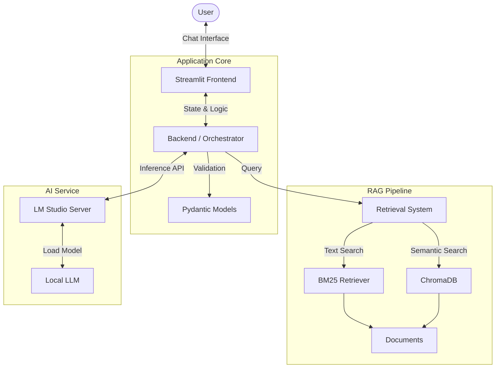

# Local RAG Chat Application using Streamlit & LM Studio

## Project Overview
This project aims to build a **privacy-first, local Chat Assistant** that runs entirely on your machine.
It leverages **LM Studio** for serving the LLM and a **hybrid RAG capability** (BM25 + ChromaDB) to retrieve relevant context from your local documents.

The application is built with **Streamlit** for the frontend and powered by **Python** with **uv** for dependency management.

---

## Architecture



---

## Tech Stack

| Component | Technology | Reasoning |
|-----------|------------|-----------|
| **Dependency Manager** | **uv** | Extremely fast Python package installer and resolver. |
| **Language** | **Python 3.10+** | Standard for AI/ML development. |
| **Frontend** | **Streamlit** | Rapid prototyping of data apps with built-in chat components. |
| **Validation** | **Pydantic** | Robust data validation and settings management. |
| **Vector Database** | **ChromaDB** | Lightweight, open-source embedding database. |
| **Keyword Search** | **BM25** | Effective, traditional lexical search for precision. |
| **LLM Inference** | **LM Studio** | Local server compatible with OpenAI's API format. |

---

## Roles & Responsibilities

This project involves collaboration across three main domains. Below is the breakdown of tasks for each role.

### Frontend Engineer (Streamlit)
**Focus:** User Experience, Interface, State Management.
*   **Tasks:**
    *   Initialize the Streamlit app (`st.set_page_config`).
    *   Build the Chat Interface using `st.chat_message` and `st.chat_input`.
    *   Manage Session State (chat history, selected documents, model parameters).
    *   Display retrieved chunks/references for transparency.
    *   Handle user feedback (thumbs up/down) if required.

### Backend Data Engineer
**Focus:** Data Ingestion, Models, Application Logic.
*   **Tasks:**
    *   **Data Models**: Define Pydantic schemas for `ChatMessage`, `RetrievalResult`, and `AppConfig`.
    *   **Orchestration**: Create the controller logic that connects the UI inputs to the RAG pipeline.
    *   **Ingestion Pipeline**: Write scripts to parse `documents/` (TXT, PDF) and load them into ChromaDB.
    *   **Concurrency**: Ensure the app stays responsive during generation (streaming).

### AI / RAG Engineer
**Focus:** Retrieval Quality, LLM Integration, Prompting.
*   **Tasks:**
    *   **Hybrid Retrieval**: Implement a class combining BM25 (sparse) and ChromaDB (dense) results.
    *   **LM Studio Client**: Configure the `openai` client to point to `localhost:1234`.
    *   **Prompt Engineering**: Design the system prompt to effectively use retrieved context.
    *   **Evaluation**: Test retrieval accuracy (`Did we get the right document?`) and generation quality.

---

## Getting Started

### 1. Prerequisites
*   Install **[LM Studio](https://lmstudio.ai/)** and load a model (start the server on port `1234`).
*   Install **[uv](https://github.com/astral-sh/uv)**.

### 2. Setup Project
```bash
uv sync
```

### 3. Folder Structure
```
.
|-- documents/          # Place your txt/pdf files here
|-- src/
|   |-- app.py          # Main Streamlit Entrypoint
|   |-- models.py       # Pydantic Schemas
|   |-- rag.py          # Retrieval Logic (Chroma + BM25)
|   |-- llm.py          # LM Studio Client Wrapper
|   `-- orchestrator.py # Ties retrieval and LLM together
|-- verify_backend.py   # Headless end-to-end check (no UI)
|-- README.md
`-- pyproject.toml
```

### 4. Run the App
```bash
uv run streamlit run src/app.py
```
